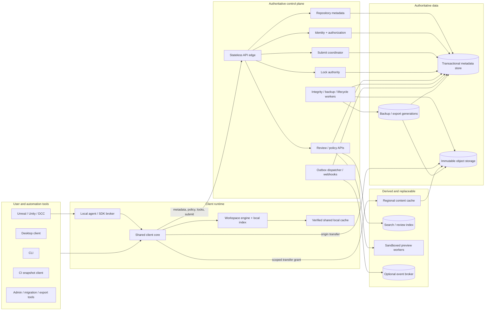
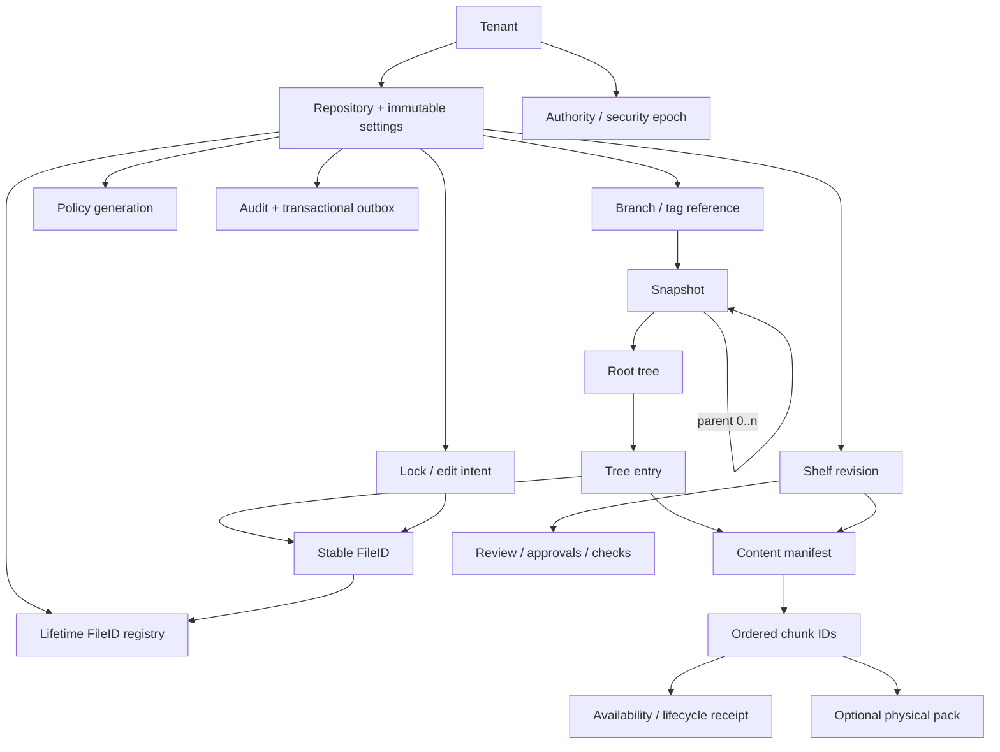
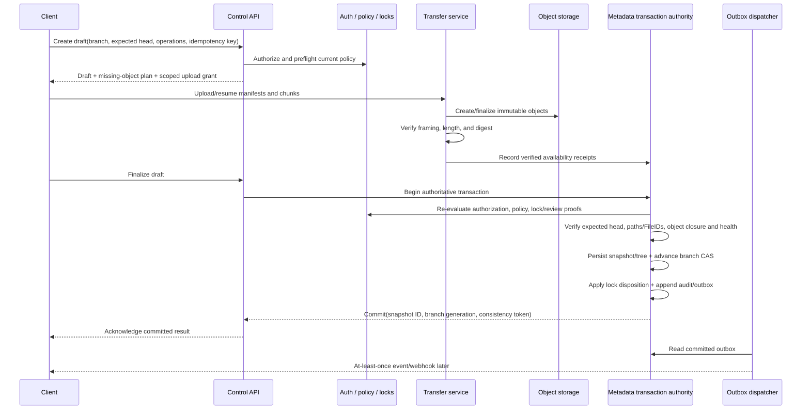

# OpenGameVCS architecture

**Status:** Proposed implementation baseline  
**Architecture version:** 0.3
**Last updated:** 2026-08-16
**Applies to:** [OpenGameVCS delivery roadmap](prd/ROADMAP.md)  
**Source:** [Game-development VCS analysis and proposal](GAME_DEV_VCS_ANALYSIS.md)

## 1. Purpose and authority

This document describes the target architecture for OpenGameVCS before implementation begins. It defines the system boundaries, authoritative state, consistency model, critical protocols, security boundary, deployment evolution, and non-negotiable failure invariants that independently developed PRDs must preserve.

Accepted cross-cutting decisions are recorded in the [`adr/`](adr/) directory. An ADR explains why a choice was made; this document remains the normative description of the resulting architecture.

This is not a detailed design for every module. The following interpretation applies:

- **Architectural invariant:** mandatory across all conforming implementations. Changing one requires an architecture decision record (ADR), updates to this file and affected PRDs, new compatibility/migration rules, and reliability/security review.
- **Reference design:** the intended implementation for the first supported release. It may change through an ADR without changing the logical protocol or repository format.
- **Deferred choice:** deliberately owned by a named PRD. No implementation may create an undocumented private contract while the choice is open.

When this document and a PRD disagree, development stops until the owning PRD and this architecture are reconciled. Database layouts, wire encodings, and internal code organization are never allowed to silently redefine the public logical model.

## 2. Product and system boundaries

OpenGameVCS is a hybrid centralized VCS for game code and original assets. It combines:

- a strongly consistent service authority for repository metadata, branch heads, path authorization, hard locks, reviews, audit, and commit acknowledgement;
- immutable content-addressed payload storage and regional caches optimized independently for large transfers;
- local workspaces with explicit partial materialization, a compact change index, a shared verified content cache, and offline checkpoints;
- native CLI, desktop, engine, DCC, CI, migration, export, and administrative clients over public versioned contracts.

The system is responsible for source history and collaboration. It is not a general artifact store, build farm, digital-asset-management system, or real-time collaborative editor. Build outputs, symbols, cooked assets, and reconstructible engine caches belong in dedicated artifact/cache systems and reference an immutable OpenGameVCS snapshot.

### Explicit non-goals

- No arbitrary merge of opaque binary formats.
- No offline guarantee of exclusive ownership for hard-lockable content.
- No peer-to-peer or multi-master metadata authority.
- No active-active branch or lock writes across regions in the initial production architecture.
- No path hash, content digest, cache key, or object URL as an authorization credential.
- No server-side mutable “have list” for every ephemeral CI worker.
- No dependency on a vendor account or license service to read existing data or continue a self-hosted deployment.
- No P4 wire-compatible server and no permanent bidirectional Git synchronization in the baseline.

## 3. Non-negotiable invariants

These invariants have priority over performance and convenience:

1. **Content-complete acknowledgement.** A branch can reference a snapshot only after every required manifest and chunk is verified and marked durable. An acknowledged snapshot must never intentionally reference missing content.
2. **One metadata authority.** All authoritative mutations for a repository—branch/tag heads, snapshots, locks, policy, audit, outbox, retention coordination—serialize through one fenced transactional authority.
3. **Immutable published history.** Published snapshots, trees, manifests, and chunks are immutable. Correction creates new objects and new history; it never edits bytes under an existing ID.
4. **Canonical identity.** Format version 1 uses the deterministic-CBOR profile and domain-separated SHA-256 object IDs fixed by ADR-0008. Canonical framing scan, known-kind schema validation, and semantic feature/profile validation are distinct reported layers: readers may hash and byte-preserve canonical objects with unsupported required features but never interpret them semantically. No layer normalizes noncanonical input. Physical database rows, pack files, compression, and backend keys do not define logical identity.
5. **Stable file identity.** Move and rename preserve an opaque repository-scoped `FileID`; copy creates a new `FileID`. Locks, history, reviews, and integrations follow `FileID`, not only a path string.
6. **Canonical paths.** Paths are slash-separated relative UTF-8 NFC segments under an immutable repository case/platform profile. Format v1 freezes the Unicode 15.0.0 `Age <= 15.0` scalar repertoire from its vendored authority, rejects every scalar outside that repertoire before NFC evaluation, and therefore never delegates identity validity to a host's evolving Unicode database. The server rejects collisions and unsafe materialization states before publication.
7. **Authorization before disclosure.** Every list, tree, history, lock, event, search, review, preview, export, and object operation applies the same versioned policy contract. A denied actor must not learn protected existence or metadata through another surface.
8. **Server-enforced hard locks.** Read-only filesystem flags are hints. The final submit transaction is the security/correctness boundary and rejects an invalid, stale, wrong-domain, or missing lock proof.
9. **Atomic visible mutation.** Submit either advances one branch to one complete snapshot with its audit/outbox/lock disposition, or leaves the previous visible state. Drafts and uploaded objects are never branch history.
10. **Derived systems are disposable.** Regional caches, local caches, search indexes, preview artifacts, read models, and event-broker projections may improve performance but are not authorities and can be rebuilt.
11. **Snapshot-pinned automation.** Sync, review checks, builds, exports, and mirrors bind to immutable snapshot/revision IDs. “Latest” may be resolved once at job start but is not followed during the job.
12. **Truthful offline behavior.** Local checkpoints preserve work offline. A disconnected client reports lock state as unknown/unverified and never claims continued exclusivity.
13. **Recoverability is executable.** Backup, restore, export, verification, repair, failover, and upgrade have machine-readable evidence and are exercised regularly. Replicas and caches are not backups.
14. **Open exit.** The canonical format, protocols, conformance vectors, full portable export, verifier, and clean import work without a running vendor service.

## 4. System context

OpenGameVCS has a control plane and a content plane. The split is logical and scaling-oriented; it does not require separate microservices in the starter deployment.



### Control plane

The control plane authenticates the caller, filters all metadata, issues content-transfer grants, creates/reads immutable metadata, manages mutable references and locks, and performs atomic submit. Its write path is strongly consistent. It handles metadata and decisions, not bulk file bytes.

### Content plane

The content plane stores immutable manifests, chunks, and optional pack objects. Clients transfer content directly to an authorized origin endpoint or a regional cache using short-lived scoped grants. Every client verifies final logical identity; the cache and transport are not trusted to define correctness.

### Derived plane

Search, preview, analytics, event-broker projections, and caches are deliberately outside the authoritative transaction. Their failure may degrade discovery, review convenience, or throughput, but cannot publish history, grant access, validate a lock, or destroy source data.

## 5. Architectural components

The first server should be a **modular monolith with workers**, not a fleet of independently persisted microservices. Modules expose versioned internal interfaces and own their tables, while the submit coordinator can compose one database transaction across the metadata, authorization, lock, audit, and outbox modules. Components may split into processes later only if the invariant-preserving transaction boundary remains explicit.

| Component | Responsibility | Authoritative state | Initial process boundary |
|---|---|---|---|
| Foundation libraries | Canonical objects, paths, authorization contracts, fixture and fault schemas | No runtime mutable state | Shared packages/tools |
| Client core | Protocol client, retries, capabilities, transfer verification, operation orchestration | No server authority | Embedded in CLI; reused by desktop/agent |
| Local agent | First-party authenticated loopback IPC, workspace job/lock coordination, integration consent and desktop handoff | User-local recoverable state; never server authority | Client-side background process from R1 |
| Workspace engine | Workspace spec, materialization, local index, checkpoints, conflicts | Local recoverable state | Client process/library |
| API edge | TLS, authentication entry, version/capability negotiation, rate limits, routing, correlation | Sessions only through owned module | Main server process |
| Identity/authorization | Identities, groups, policies, decisions, transfer grants, audit access | Policy/session/audit records | Main server module |
| Repository metadata | Repositories, immutable snapshot/tree objects, refs, FileID/history indexes, idempotency/outbox primitives | Transactional metadata | Main server module |
| Submit coordinator | Draft/preflight/finalize state machine and atomic publication | Submit drafts/idempotency; composes transaction | Main server module |
| Lock authority | Edit intent, hard locks, groups/domains, leases, generations, queues, takeover | Transactional lock state | Main server module |
| Content transfer | Missing-object negotiation, upload sessions, verification, backend abstraction, download plans | Transfer sessions and availability receipts | Same distribution; separable endpoint/process |
| Review service | Shelves, immutable revisions, comments, approvals, required checks, promotion plan | Transactional review metadata | Main server module initially |
| Event dispatcher | Reads committed outbox, publishes API events/webhooks, tracks retries/cursors | Delivery cursors/attempts | Worker process |
| Integrity/lifecycle workers | Scrub, quarantine, repair, backup, restore, retention, GC | Durable job/finding/generation state | Worker process |
| Search indexer | Builds authorized derived documents and invalidates by policy generation | Rebuildable index | Separate worker/index service |
| Preview service | Runs untrusted converters and stores derived artifacts/provenance | Rebuildable artifacts/job records | Isolated worker pool |
| Regional cache | Serves verified immutable objects under scoped grants | Disposable cache entries | Independent regional service |
| Administration | Bootstrap, configuration, health, migrations, diagnostics, upgrade orchestration | Deployment configuration/ledger | Server/admin CLI |

No module except the owning module or the transaction coordinator may rely on another module's private table layout. No external client reads the database or object backend directly without a versioned service contract and authorization grant.

## 6. Logical data model



### 6.1 Repository settings

A repository stores immutable settings selected at creation:

- repository-format version and required features;
- case mode (`case-sensitive` or versioned `case-folded`);
- supported-platform/path profile and structural limits;
- default chunk/content-policy profiles;
- tenant/deduplication boundary;
- default branch, lock, review, retention, and signature policies.

Changing identity, case, normalization, or required-format semantics is a migration, not a configuration edit.

### 6.2 Snapshot

A snapshot is an immutable canonical object containing:

- zero or more ordered parent snapshot IDs;
- root tree ID;
- author/committer references and timestamps;
- message;
- exact ordered path/FileID operations;
- policy result and optional provenance references.

Issue and review associations are service-owned references to the completed
snapshot; format v1 does not place issue or review fields in snapshot bytes.

The snapshot graph alone is sufficient to reconstruct immutable history. Mutable branches, locks, live sessions, and search indexes are not required to interpret snapshot bytes.

Attestations and signatures point to the completed snapshot ID and are discovered as inbound subject references; the snapshot does not point back to an attestation that signs it. Snapshot-reachable provenance is permitted only when it is created first and has no backlink, so canonical identity never contains a signature cycle.

### 6.3 Tree and tree entry

A canonical tree represents exactly one directory as a definite entry array strictly ordered by NFC UTF-8 basename bytes. Before NFC evaluation, format v1 rejects any scalar outside the vendored Unicode 15.0.0 `Age <= 15.0` repertoire; later host Unicode assignments cannot change which format-v1 text is valid. Encoding and verification operate over an ordered iterator and do not require materializing the array. A physical representation may be sharded or indexed only as a source for that iterator; page boundaries are never canonical bytes and cannot affect identity. Each named entry, including a directory, contains:

- canonical name and entry kind;
- stable `FileID`;
- portable mode/type information;
- manifest/object ID and logical size;
- content policy class.

Moves preserve `FileID`; copies allocate a new one. Deleting a path does not erase its historical `FileID`. Recreating the same path is a new identity unless an explicit restore operation preserves the old identity under defined rules.

Format version 1 represents `FileID` as an opaque 128-bit value. Native clients generate nonzero values from a cryptographically secure random source so offline creates do not require a server round trip. A FileID is unique for the lifetime of its repository across published history, active drafts, shelves, and retained tombstones; it is never reassigned after deletion. A tree cannot contain the same FileID more than once because hard links/aliases are not part of format version 1.

The server distinguishes create, copy, move, restore, and import operations. Create/copy must introduce a previously unused FileID; move/rename must prove the FileID exists at the expected base; restore may reuse a historical FileID only through the explicit restore rule. A repository-scoped unique registry and final-transaction checks reject duplicate, forged, cross-repository, or concurrently colliding IDs. Importers allocate IDs once, persist source-to-target mappings, and reuse those mappings on retry rather than derive identity from a mutable path.

OGVCS-002 fixes lexical segment bytes and ordering plus the entry-kind and portable-mode codepoints used in canonical trees. It also fixes hard parser/object maxima, including the one-million-entry tree ceiling. OGVCS-004 consumes those bytes and owns joined-path validity, case folding and collision keys, supported-platform profiles, reserved names, symlink/materialization rules, and filesystem safety; its ratified profiles select operational segment/path/depth limits no greater than the core maxima. A case-only rename therefore changes canonical tree bytes while preserving FileID; the configured path profile decides whether that operation is admissible.

### 6.4 Content manifest, chunk, and pack

A file version points to the OGVCS-002 `ContentManifestV1` envelope containing logical length, typed whole-file SHA-256, a registered chunk-profile reference, and an ordered sequence of typed chunk IDs and lengths. OGVCS-002 owns these canonical bytes and the object/chunk hash preimages. OGVCS-007 owns production content-defined boundary algorithms, fingerprint input and parameters, policy selection, streaming generation/reconstruction, and ratified chunk-profile entries; it cannot redefine the envelope or preimages.

Chunks are logical content objects. OGVCS-008 owns packs, compression, placement, and transfer framing as physical optimizations that group chunks and provide indexes for range reads. Repacking, recompression, cache placement, or backend migration cannot change a manifest, chunk ID, or file digest. A nonidentity hint is a non-object typed logical annotation record that references its subject ObjectID and a registered payload profile. It is excluded from the subject preimage but protected by bundle/export integrity.

Deduplication is scoped to the configured security tenant by default. It is an optimization, not an authorization mechanism or guaranteed compression ratio.

### 6.5 Mutable references

Branches and tags are versioned pointers to snapshots. Branch advance requires an expected prior value and compare-and-swap inside the authoritative transaction. History rewriting/force update is not a baseline operation; administrative reference change uses an explicit audited policy and never mutates immutable objects.

### 6.6 Draft submit

A draft contains repository, target branch, expected head, ordered operations, required object closure, policy/lock/review proof references, actor/workspace, and idempotency key. Drafts are not history and are not returned by branch/history reads. They expire only after a safety window that preserves retry and recovery.

### 6.7 Lock and edit intent

A lock record contains target (`FileID`, bounded prefix, or versioned asset group), repository and branch/domain, owner and workspace, base snapshot, mode, authority epoch, generation, server-time lease, state, wait/handoff state, and audit reason. Authority epoch plus lock generation prevents pre-failover or delayed renew/release messages from mutating a later lease.

### 6.8 Shelf and review

A shelf revision is immutable and content-complete but does not advance a branch. Review comments, approvals, and check results bind to one exact shelf revision and policy generation. Updating content creates another revision and invalidates approvals/checks according to policy.

### 6.9 Audit and outbox

Privileged and security-relevant mutations append typed, access-controlled audit records. State changes that require external notification append an outbox record in the same metadata transaction. Outbox delivery is at least once; event IDs and consumer idempotency provide convergence.

### 6.10 Core graph, profile registries, and logical exchange

The format-v1 immutable graph and transition rules are fixed by ADR-0009. A repository has exactly one designated zero-parent root; every other snapshot has one to eight ordered, unique parents in the same repository and reaches that root. The first parent is the change-set base. Published snapshots are conflict-free, and replay of their ordered transitions must reproduce their declared tree and group roots. Canonical logical exchange/reference projections may carry branch/tag pointers, pending-change references, latest-shelf pointers, lock references, and lifetime/import facts, but they are not immutable snapshot dependencies and do not exhaust or constrain the authoritative mutable schemas and state machines owned by OGVCS-006, OGVCS-010, OGVCS-016, OGVCS-018, and OGVCS-025. Review, audit/outbox, and lifecycle-receipt state remain with those owners unless a later additive registry assignment defines a bounded exchange projection.

Core schemas refer to additive path, chunking, content-policy, group, feature, extension, annotation-payload, and logical-record registries through immutable `ProfileRef` values. Registry IDs are never reassigned or redefined; new behavior receives a new ID or major version. Reserved entries cannot appear in data; conformance-only entries are limited to declared tests; ratified entries are readable/writable; deprecated entries remain readable but cannot be selected for new production writes. Unknown required entries fail semantic validation, while canonical framing can still hash/store/forward their bytes and promised lossless processing preserves unknown optional extensions.

OGVCS-002 defines a deterministic, bounded CBOR-sequence logical bundle for a caller-supplied set of canonical objects and typed logical records, declared roots, and an integrity trailer. It validates the supplied set and root closure only. This exchange form is not a product export and makes no authorization, consistent-generation, repository-completeness, fidelity, projection, signature, volume, incremental, restoration, or import claim.

## 7. State ownership and consistency

| State | Authority | Consistency | Cache/read rule |
|---|---|---|---|
| Repository settings | Transactional metadata store | Strong; immutable after creation except migration | Cache by settings generation |
| Snapshot/tree metadata | Transactional metadata store | Immutable once published | Replicas allowed with declared consistency token |
| Branch/tag head | Fenced metadata leader | Linearizable mutation/CAS | Strong read by default; explicitly bounded-stale reads may be offered |
| Manifest/chunk bytes | Immutable object backend plus lifecycle receipt | `staged → available ↔ quarantined → deleting → deleted`; verified before available | Submit accepts only available objects; local/regional caches must revalidate identity |
| Identity/session/policy | Identity/authorization module in metadata authority | Strong mutation; bounded session/grant expiry | Decision cache keyed by policy/session generation |
| Hard lock/edit intent | Same fenced metadata authority as submit | Linearizable conflicting acquire/mutation | Client state is advisory; submit revalidates current generation |
| Shelf/review/approval | Transactional metadata store | Strong for revision and promotion decisions | Read models may be eventual but promotion revalidates authority |
| Audit/outbox | Same commit as state mutation | Durable atomic append; delivery at least once | External sinks/brokers are projections |
| Search index | Derived index | Eventual and generation-labeled | Query-time authorization; fail closed on unsafe staleness |
| Preview artifact | Derived artifact store | Immutable per inputs/tool/policy generation | Authorization rechecked on every retrieval |
| Local workspace/index | Client-local journal/database | Recoverable, not globally authoritative | Reconcile watcher gaps before clean result |
| Backup/export | Captured metadata generation plus content inventory | Immutable evidence generation | Must verify before activation/use |

### Read consistency

- Branch resolution for a mutating workflow is strong and returns a consistency token.
- Once resolved, sync/build/review reads bind to the immutable snapshot rather than repeatedly reading a moving branch.
- Read replicas may serve immutable objects and explicitly bounded-stale lists only when authorization policy freshness is safe and the response states its consistency token.
- Authorization, hard-lock acquisition, transfer-grant issuance, submit finalize, policy mutation, and reference mutation never use an unqualified stale replica.

## 8. Physical persistence

### 8.1 Transactional metadata store

The reference production store is PostgreSQL or another well-supported open transactional database that passes the same application-level conformance tests. The logical schema contains:

- tenants, repositories, immutable settings, format/capability generations;
- canonical snapshot/tree records and FileID/path/history indexes;
- branches/tags and compare-and-swap generations;
- object-availability receipts and content-health state;
- identities, sessions, groups, policies, grants, revocation generations;
- locks, edit intents, domains, leases, queues, and generations;
- submit drafts/idempotency, shelves/reviews/checks;
- audit records, outbox, delivery cursors;
- integrity findings, backup/restore/GC generations, migration/upgrade ledgers.

Schema migrations use expand/migrate/contract phases, checksums, compatibility fences, and resumable ledgers. A database snapshot without its content reachability boundary is not a valid backup.

### 8.2 Immutable object storage

The starter deployment supports a confined filesystem backend and one S3-compatible profile. Backends must implement the same contract:

- opaque internal keys with no user path data;
- create-if-absent/finalize semantics;
- read, range read, size and metadata verification;
- safe listing by internal namespace;
- immutable/versioned behavior and preconditioned deletion;
- known durability acknowledgement behavior.

The transfer service records an availability receipt only after backend finalization and independent length/digest verification. The receipt is a versioned lifecycle record with state and generation. The submit transaction trusts only a current `available` receipt and health generation, not a client claim or raw `HEAD` result. If an object exists without a receipt, it is harmless staging and can be reverified. If a receipt exists but the object is later missing/corrupt, integrity processing marks it unhealthy, blocks new dependent publication, and repairs or degrades affected roots explicitly.

Lifecycle transitions serialize through the metadata authority. GC may move an unreachable object from `available` to `quarantined` only after a current-root check. During grace, a submit may atomically cancel quarantine and restore `available` if the verified bytes still exist. After a current-root recheck, GC may CAS the exact quarantine generation to `deleting`; submit never references `deleting` or `deleted` state. Physical deletion carries the deleting generation as a precondition and is followed by a durable deletion receipt. This metadata fence, rather than an object-store condition alone, prevents a new reference from racing deletion.

### 8.3 Local and regional caches

Client caches store verified immutable bytes keyed by tenant/security scope, algorithm, and object ID. Credentials and authorization decisions are not reusable cache entries. Dirty workspace files never share immutable cache storage.

Regional caches are read-through and disposable. They receive a short-lived audience-bound grant, verify fill and reads, and fall back to origin. Destroying every regional cache changes latency and origin egress only.

### 8.4 Search and preview stores

Search indexes and derived previews are separate from repository truth. Both records include source object/revision, policy generation, schema/converter version, and provenance. Authorization is evaluated again on query/retrieval. Removing an index or preview store never removes source content or review decisions.

## 9. Public protocols and internal contracts

ADR-0013 fixes the R0 reference control profile as TLS 1.3 over HTTP/1.1 with
bounded schema-first JSON messages and separately negotiated transfer-carrier
semantics. Later wire profiles may be added only through explicit negotiation
and must preserve these rules:

- TLS for non-loopback communication.
- Versioned schema-first messages and explicit capability negotiation.
- Independent versions for repository format, API protocol, event schema, transfer framing, and extensions.
- Stable typed errors with retryability, conflict, authorization-safe reason, and correlation ID.
- Idempotency keys for every retryable mutation.
- Stable cursors and explicit cursor expiry/gap behavior for pagination/events.
- Bounded request sizes, nesting, fanout, history depth, paths, and concurrency.
- Machine-readable output and public conformance vectors.
- No implicit access to another service's database or filesystem.

### 9.1 Control-plane API families

- identity/session/service principal and capability negotiation;
- repository/settings, immutable metadata, branch/tag, tree/history/diff;
- workspace selection/sync planning and signed content-transfer plans;
- draft/preflight/finalize/idempotency status;
- edit intent/lock acquire/renew/release/transfer/break/watch;
- checkpoint publication, shelves, reviews, approvals, checks, promotion;
- event cursor/webhook registration and delivery inspection;
- verification, backup/restore, retention/GC, diagnostics and upgrade administration;
- import, export, mirror, conformance, and SDK operations.

### 9.2 Transfer grant

A transfer grant is short lived and signed. It binds at least:

- issuer and key generation;
- authority/security epoch;
- tenant and repository;
- subject/session or service identity;
- allowed operation (`upload`, `download`, or bounded negotiation);
- explicit object set or a bounded authorized manifest/request root;
- endpoint audience/region;
- expiry and replay/idempotency fields.

Possessing an object ID, pack range, previous URL, or expired grant never authorizes another read. The specific signed token format is owned by the security/protocol PRDs and must support offline verification at caches without disclosing broader repository scope.

### 9.3 Event delivery

Events are created only by committed state transitions. The metadata transaction appends the event envelope to an outbox; a dispatcher later publishes it to cursors, webhooks, or an optional broker. Delivery is at least once, ordered per documented repository stream where required, and bounded by retention. Consumers deduplicate using stable event IDs and recover gaps through reconciliation APIs.

## 10. Atomic submit protocol

Atomic submit is the central correctness protocol.



### 10.1 Prepare and preflight

The client reads a branch head, computes local operations using stable `FileID`, chunks/hashes changed content, and creates a draft with an idempotency key. Preflight checks current path rules, obvious authorization/policy/lock/review requirements, branch base, structural limits, and missing objects. Preflight is advisory with respect to mutable state; finalize repeats every mutable check.

### 10.2 Content staging

The client uploads only missing manifests/chunks. Upload is resumable, idempotent, and verified. Finalized but unreferenced content is retained for a safety window. It cannot appear in repository history and knowledge of its ID does not grant access.

### 10.3 Finalize transaction

One authoritative transaction:

1. resolves the exact draft/idempotency request;
2. locks or compares the target branch generation/head;
3. re-evaluates actor/session, path authorization and policy generation;
4. validates lock/domain generation and required review/check proofs;
5. validates ordered operations, `FileID`, case/path/group invariants and snapshot parents;
6. confirms the complete manifest/chunk closure has current healthy `available` lifecycle receipts, atomically cancelling eligible quarantine before any reference is created;
7. persists immutable snapshot/tree metadata;
8. advances the branch with compare-and-swap;
9. applies lock release/retention/transfer state;
10. appends audit and outbox records;
11. commits.

No network call to an optional broker, webhook, cache, search engine, or preview service occurs inside this transaction. Required policy code must be deterministic, bounded, version pinned, and available within the authoritative decision boundary; unavailable required policy fails closed.

### 10.4 Ambiguous result

If the connection fails after commit but before response, retrying the same idempotency key and identical request returns the original result. Reusing the key with different bytes is rejected. A commit receipt includes the authority epoch, repository, idempotency key, snapshot ID, branch generation, and consistency token. A caller can query transaction status and receives committed, not committed, or still unknown/recovering—never an invented retry result.

## 11. Sync and workspace protocols

### 11.1 Workspace specification

Each workspace has a versioned specification containing:

- repository and branch tracking reference;
- baseline immutable snapshot;
- include/exclude selection rules;
- materialization mode (`full`, `metadata`, later `on-demand`);
- permitted lock/merge policy overrides;
- repository platform/path profile;
- local cache and resource limits.

The server does not maintain a mutable per-file have-list for every workspace. The client owns its compact local index and can reconstruct it from baseline snapshot, workspace specification, materialized filesystem, and checkpoints.

### 11.2 Explicit sync

1. Resolve the branch once to an authorized immutable snapshot and consistency token.
2. Evaluate the selection spec against a server-filtered tree; hidden paths do not enter counts or plans.
3. Compare target metadata with the local index and dirty/conflict/checkpoint state.
4. Produce a preview containing operations, transfer bytes, disk requirement, deletes/replacements, and blockers.
5. Obtain scoped download grants and fetch missing objects through local/regional/origin caches.
6. Verify chunks, manifest and whole-file digest; stage writes under a workspace-owned temporary area.
7. Recheck local preconditions, then apply safe confined atomic replacements/deletes where possible.
8. Commit the new local index/baseline generation last. A crash leaves either the prior consistent baseline or a detectable resumable/reconciliation state.

A branch moving during sync does not change the chosen target snapshot. A later update is a new explicit sync.

### 11.3 Scalable status

The local index records baseline identity, metadata, materialization state, pending operation, conflict/checkpoint state, and watcher cursor. USN Journal, FSEvents, inotify, or equivalent adapters identify candidate changes. Gaps, overflow, or unclean shutdown trigger bounded reconciliation before returning authoritative clean status. Hashing is lazy and limited to candidates unless a user requests full verification.

### 11.4 Checkpoints

A checkpoint is a local immutable operation/content manifest with parent, message, and expected baseline. New chunks remain in the verified local cache and are pinned. Checkpoints can be listed, diffed, chained, squashed, restored, and converted into a later submit request. A stored lock receipt is historical/untrusted metadata, never authority.

### 11.5 Virtual workspace

On-demand filesystem hydration is an adapter over the same workspace, index, transfer, and verification contracts. It arrives only after explicit materialization is stable. Before a write, a placeholder becomes a normal materialized file and passes start-edit/lock policy. Dirty, checkpointed, open-for-write, conflicted, uploading, or pinned data is never evicted.

## 12. Lock architecture

### Modes

| Mode | Target | Server behavior |
|---|---|---|
| Advisory intent | FileID/path/group | Concurrent work allowed; authorized warnings and ownership context |
| Hard lock | FileID/group/prefix | Conflicting acquire or final submit rejected |
| Retained lock | Integration-domain target | Ownership can survive intermediate submit until verified integration/release |

### Acquire

The client sends repository, branch/domain, target/group, workspace, base snapshot, requested mode/lease, and idempotency key. The authority canonicalizes the target, expands bounded group policy, checks authorization and relevant revision/domain policy, and atomically grants one generation or returns a non-disclosing conflict.

### Lease and stale state

Leases use server time and monotonic generations. The client/local agent heartbeats while connected. Delayed renew, release, or transfer for an older generation cannot affect a newer lock. Connectivity loss produces `unknown` locally; expiry and takeover follow an explicit audited state machine rather than silently promising ownership to both editors.

### Submit validation

Finalize checks that every hard-locked changed target has a current compatible lock generation owned by the authorized actor/workspace in the correct branch/integration domain. Rename cannot escape the lock because the target follows `FileID`. Lock disposition commits atomically with the snapshot and branch advance.

### Availability trade-off

When the lock/metadata authority is unavailable, the system favors correctness over new write availability: it grants no new exclusive lock and acknowledges no lock-protected submit. Users may checkpoint locally and reconcile later.

## 13. Identity, authorization, and trust boundaries

### 13.1 Trust zones

| Zone | Trust assumption | Required controls |
|---|---|---|
| User/client device | Potentially compromised; filesystem mutable | Short-lived credentials, server validation, verified downloads, confined writes, secure local storage |
| Control plane | Trusted to enforce current policy and metadata invariants | Least privilege, authenticated service calls, one decision contract, audit, rate/bounds, fail closed |
| Metadata database | Authoritative but still subject to corruption/operator error | Restricted principals, transactional invariants, backups, integrity/restore checks, encryption |
| Object store | Trusted for durability contract, not for logical identity or user authorization | Opaque keys, grants, digest verification, immutability/versioning, scoped credentials |
| Regional/local cache | Untrusted for authorization and correctness | Scoped grants, tenant namespace, end-to-end verification, disposable state |
| Preview/merge/hook worker | Processes hostile repository input/code | Fresh sandbox, no credentials/network, read-only inputs, strict resource/output policy |
| Operator/admin | Privileged insider risk | Separate roles, reason-bearing operations, dual control for catastrophic actions, append-only audit |

### 13.2 Authentication

The starter deployment has a recoverable single-use local bootstrap path and OIDC authorization-code-with-PKCE/device flows. Service identities are nonhuman, scoped, expiring, rotatable, and distinguishable in audit. Sessions, service tokens, transfer grants, and lock receipts bind an authority/security epoch so a DR promotion can invalidate credentials and proofs issued by the former authority. Production can disable normal local login after recovery is configured.

### 13.3 Authorization

The shared decision contract evaluates actor/session, tenant, repository, reference/snapshot context, canonical path/`FileID`, operation verb, policy generation, and relevant resource state. Missing context or evaluator failure denies. Separate verbs cover discover, metadata read, materialize, lock, submit, review, export, policy administration, repair, retention deletion, audit access, and force unlock.

Every response is constructed from an authorized view. Post-filtering an already counted/ranked global result is insufficient for trees, search, reviews, events, facets, suggestions, or caches.

[ADR-0011](adr/0011-authorization-contract-v1.md) and the versioned
authorization-contract package freeze the R0 vocabulary, deny-overrides
composition, privacy-safe decision surface, authorized-view ordering, threat
catalog, revocation ceilings, audit classes, and sandbox requirements.

### 13.4 Content authorization

The control plane authorizes content access before issuing a bounded transfer grant. Object stores and caches validate the grant issuer and trusted key ID/generation, subject, audience, operation and permission, expiry, authority epoch, tenant/repository, replay state, and object/request bounds. A request-root grant commits to a canonical bounded object-ID plan; the verifier recomputes that root from its own authenticated plan state and checks current-object membership. Holder-supplied roots, membership assertions, or verification keys are never authority. A hash is never a bearer credential. Revocation bounds are the shorter of session policy and issued-grant maximum TTL.

### 13.5 Tenancy and encryption

Deduplication, quotas, encryption policy, metrics, purge, and administration are tenant scoped. Cross-tenant deduplication is disabled by default because equality probes leak information and complicate deletion/accounting. Encryption keys are managed separately from content IDs and are never derived solely from hashes.

### 13.6 Untrusted execution

Repository hooks, merge drivers, import parsers, and preview converters run in explicit sandboxes with pinned signed runtime/tool versions, read-only declared input, isolated scratch, no credentials, no network by default, and CPU/memory/time/output/fanout limits. Derived output is validated/sanitized before publication and never becomes authoritative source implicitly.

## 14. Reviews, automation, and integrations

### Shelves and reviews

Shelf content uses the same upload, verification, authorization, reachability, and retention mechanisms as branch content. Review approval binds an immutable revision. Promotion calls the normal submit coordinator and revalidates target head, authorization, policy, locks, checks, and content; review cannot bypass the branch transaction.

### CI

CI resolves a branch once, receives an immutable snapshot plus selection spec, and materializes only required files into an ephemeral workspace using a node-local verified cache. A provenance statement records snapshot, selection, resulting root digest, client/tool version, and build link. CI services use short-lived path-scoped identities.

### Engine and DCC integrations

Engine/DCC plugins remain thin adapters over shared client/local-agent APIs:

- Unreal maps packages, sidecars, external actors, redirectors, dirty editor state and commandlets to workspace/lock/sync operations.
- Unity treats assets and `.meta` files as groups, validates serialization/cache policy, and invokes a pinned sandboxed semantic merge driver.
- Godot/Blender and third-party tools use the public local SDK and never embed object-store credentials or duplicate submit logic.

Complex conflict, review, submit, destructive, or recovery decisions hand off to the desktop client with authenticated local context.

The minimal first-party local-agent/IPC contract is delivered before engine integrations. The later ecosystem SDK broadens languages, simulator coverage, third-party stability, and public conformance; it does not retroactively invent the IPC used by first-party plugins. Local IPC protects against other OS users, unauthenticated clients, stale/replayed capabilities, and accidental overreach. It does not claim to defeat malware already executing with the same user privileges; sensitive mutations require explicit scoped consent or a trusted desktop confirmation, and production documentation states this boundary.

### Events and webhooks

Automation consumes durable cursors or signed webhooks from the outbox dispatcher. Payloads are authorization-filtered for the consuming identity at the documented evaluation time. Duplicate delivery is expected; event IDs are stable. A broker outage cannot roll back or hide the committed snapshot permanently.

## 15. Deployment architecture and evolution

### 15.1 Starter deployment — R1

The first supported topology prioritizes operability and correctness:

```text
Clients
  -> TLS endpoint
  -> ogvcs-server (modular API + metadata + auth + submit + locks)
  -> PostgreSQL-compatible transactional database
  -> filesystem or one supported S3-compatible object backend
  -> ogvcs-worker (outbox, verify, backup, retention jobs)
```

An optional all-in-one package may place server and worker in one distribution, but durable roles remain explicit. No external event broker, search cluster, cache fleet, Kubernetes operator, or vendor service is required. One repository write authority exists.

### 15.2 Studio deployment — R2

- Multiple stateless API/transfer instances may run behind a load balancer.
- Metadata still writes through one transactional primary/authority.
- Regional read-through content caches reduce WAN payload.
- Review/search projections and sandboxed preview workers run separately.
- Outbox dispatch may use a broker if scale justifies it; the database outbox remains the committed source.
- Observability, capacity forecasting, signed packages, and rehearsed backup/restore are mandatory before production shadowing.

### 15.3 Production deployment — R3

- Same-region metadata uses one supported quorum/HA database topology and fenced leader.
- Stateless API instances negotiate compatible versions and drain for rolling upgrade.
- Object storage is immutable/versioned and replicated according to declared durability.
- Cross-region DR asynchronously replicates metadata plus reachable content and publishes a monotonic verified recovery point.
- Region promotion is manual, dual-controlled, and requires proof the former authority is fenced.
- Search, preview, cache, and broker remain non-authoritative and independently recoverable.

### 15.4 Global behavior

Metadata writes and exclusive locks retain one authority per repository. Read metadata can use replicas when the caller accepts the declared consistency and policy freshness. Payload transfer and cache hits stay regional. This trades some cross-region metadata latency for unambiguous branch and lock correctness.

## 16. High availability, disaster recovery, and lifecycle

### Same-region HA

Only the current fenced leader may acknowledge authoritative writes. Client retries carry idempotency IDs and can resolve unknown outcomes after failover. The reference target is RPO 0 for acknowledged metadata transactions and service RTO at or below five minutes for any supported single-node loss.

### Cross-region DR

Asynchronous DR tracks both metadata log position and content inventory. A recovery point is eligible only when every object reachable from its published roots verifies in the recovery region. Promotion never exposes a metadata root newer than this verified point. The reference target is verified RPO at or below five minutes and operator-driven RTO at or below 60 minutes.

Promotion creates a new monotonic authority/security epoch before writes reopen. Sessions, service tokens, transfer grants, lock leases/receipts, idempotency lookups, and commit receipts from an earlier epoch are rejected or resolved through the recovery API; restored locks return as expired/reacquire-required rather than silently held. Key rotation plus infrastructure, credential, and network fencing prevent the old region from accepting writes.

The promoted authority publishes a signed recovery boundary containing the old/new epoch, last verified metadata position, branch generations, and content inventory generation. Clients compare old commit/idempotency receipts with this boundary. A receipt beyond it is reported as `not present after recovery` or `requires reconciliation`, never as ordinary success or an unexplained missing snapshot; the client can safely stage/resubmit from its retained draft/content. The immutable promotion/recovery ledger records all reconciled results. Failback treats the promoted region as truth and reseeds the old primary; divergent histories are never merged as two authorities.

### Backup and restore

A backup generation captures metadata generation, schema/protocol versions, branch/tag roots, lock/audit treatment, configuration requirements, content inventory boundary, and checksums. Completion requires proof that every reachable content object has a verified copy in the designated backup target under independently scoped credentials and retention. Presence only in the production object backend, a cache, or a replica never completes a backup generation.

Restore occurs into an isolated clean target, verifies the whole graph/content and compatibility, and becomes active only after validation. Backup credentials and stores are separable from production credentials. A replica is not accepted as a backup.

### Integrity and repair

Reads verify object framing and identity. Continuous sampling and resumable full scrubs traverse snapshot → tree → manifest → chunk. A corrupt copy is quarantined; repair copies only from an independently verified source. If no valid source exists, affected objects/snapshots become explicitly degraded and reads fail rather than invent content.

### Retention and garbage collection

Reachability roots include branches, tags, protected snapshots, shelves/reviews, legal holds, pins, active submits/uploads, backups and policy retention. GC captures a generation and produces a dry run. Each candidate then passes a current-root check and lifecycle CAS into quarantine. After grace, a second current-root check and CAS acquires the `deleting` generation before physical deletion. Submit can revive only quarantined objects and never references deleting objects. Crashes resume from lifecycle records; a concurrent new reference either cancels quarantine or is rejected before publication, so reachable data cannot be deleted. GC is not enabled until a clean independently retained restore has passed.

## 17. Failure semantics

| Failure | Required behavior |
|---|---|
| Client dies during upload | Verified parts/session remain resumable; no branch state changes |
| Transfer service dies after object write, before receipt | Object is harmless unreferenced data; retry verifies and records availability |
| Object backend acknowledges corrupt/incomplete data | Final verification fails; object never becomes available |
| API/server dies before metadata commit | Old branch/lock/policy state remains visible |
| Server commits, response is lost | Same idempotency request resolves to original committed result |
| Event broker/webhook is down | Commit succeeds with durable outbox; delivery retries later |
| Authorization evaluator/current policy is unavailable | Protected operations fail closed; no fallback identity/path is used |
| Lock authority is unreachable | No new hard lock or protected submit; local checkpoint remains possible |
| Branch head advances during another submit | Compare-and-swap loser retains draft/content and receives conflict/rebase plan |
| Local watcher overflows or client shuts down uncleanly | Status reconciles before claiming clean |
| Sync loses network/power | Prior baseline or explicit resumable recovery state; local dirty bytes preserved |
| Local/regional cache is corrupt | Digest failure, quarantine/evict, refetch from verified source |
| Entire regional cache is lost | Performance/origin egress degrade; no source data or metadata loss |
| Search index is lost | Browse/search convenience degrades; rebuild from authority; submit unaffected |
| Preview parser crashes/escapes resource budget | Job fails/worker is discarded; source/review remains available without preview |
| Metadata leader fails | Fenced failover; idempotent transaction resolution; no dual authority |
| DR metadata arrives before content | Recovery point does not advance until reachable content verifies |
| Old primary returns after region promotion | Epoch/credential/network fencing denies writes; it must be reseeded |
| Client presents a pre-promotion session, grant, lock, or commit receipt | New epoch rejects authority claims; recovery boundary resolves commit state and requires lock/session reacquisition |
| GC races a new reference while quarantined | Submit atomically revives the exact quarantine generation before publication |
| GC has entered deleting before a new reference | Submit fails before publication; re-upload/reverification creates a new available generation after deletion completes |
| Backup is corrupt/incomplete | Restore verification fails in isolation; production is not replaced |

## 18. Observability and capacity

Every request, background job, transaction, transfer, lock, event, backup and cache path carries a privacy-safe correlation ID. Signals use a versioned schema with bounded labels and explicit units.

Correctness signals are separate from availability/latency and can never be averaged away:

- acknowledged root with missing/corrupt content;
- unauthorized successful disclosure/retrieval;
- conflicting successful hard-lock submits;
- branch/outbox atomicity failure;
- split metadata authority/fencing failure;
- failed restore/export verification.

Capacity accounting distinguishes logical history bytes, unique durable bytes, staging, replication, cache, backup, request/metadata growth, and egress. Default metrics/logs/traces exclude content, commit messages, credentials, user identities, and protected full paths. Diagnostic bundles are allowlisted, previewable, bounded and redact by construction.

The initial targets and exact benchmark environment live in the roadmap/PRDs; no target may be met by weakening verification, authorization, durable acknowledgement, or state honesty.

## 19. Interoperability and exit architecture

### Imports

Git/LFS and Perforce importers split credentialed acquisition from parsing. A minimal broker uses read-only source credentials to fetch immutable bounded inputs into staging; credential-free parser workers receive only declared inputs, have no network by default, and run under the common sandbox/resource contract. Importers inventory/preflight first, convert deterministically into an isolated namespace, retain durable source-to-target and FileID mappings, verify content/graph, reconcile declared source tips, and publish target refs only as a final atomic step. Shadow migration is one-way until a coordinated authority cutover.

### Git mirror

The native code+asset snapshot remains authoritative. A configured authorized path view projects deterministically into Git commits and LFS objects, records every snapshot disposition, uploads/verifies LFS before advancing a dedicated ref, and halts rather than force-pushing over unexpected destination changes. No Git write mutates native history.

### Open export

Export profiles consume OGVCS-002 canonical object bytes and typed logical records without redefining their hash preimages. The OGVCS-002 logical bundle is not evidence that repository selection was authorized, generation-consistent, or complete.

Export has two non-interchangeable modes:

- **Repository-complete fidelity export** requires the exporter to be authorized for every selected reachable immutable and mutable record. Mixed-visibility selection fails atomically before writing a usable container. It preserves canonical object/snapshot/root IDs and is the only mode that claims identical-root restoration.
- **Authorized projection export** emits only the caller's authorized view. Every projection creates a distinct repository descriptor with a new repository identity, required projection feature, declared identity class, and public non-disclosing provenance reference. Every repository-scoped projected object binds that descriptor, forcing new tree/snapshot IDs even for a full-view projection; path-independent manifests/chunks may retain content IDs. It uses the core hash formula rather than a private preimage, records explicit non-disclosing omissions plus protected signed provenance/redaction mapping, and never claims full-fidelity restoration or identity with the source roots.

Both modes exclude secrets/private keys/tokens and use a separately implemented offline verifier for their declared profile. Clean import of a fidelity export stages, verifies, and atomically publishes identical roots with reconciliation evidence. Projection import publishes a distinct derived history and cannot replace or masquerade as its source repository.

### Third-party implementation

Public specifications, capability negotiation, golden vectors, conformance runner, local SDK, and hosting certification tooling are independently usable under an OSI-approved license and require no vendor credentials.

## 20. Reference implementation choices

These choices are defaults, not substitutes for the logical contracts:

| Area | Reference default | Status/change owner |
|---|---|---|
| Canonical/core implementation | Rust library plus at least one independent codec implementation | R0 baseline; OGVCS-002 |
| Server shape | Rust-oriented modular monolith plus worker distribution | Reference choice; service PRDs/ADR may revise language/process boundaries |
| Metadata database | PostgreSQL-compatible transactional store | Reference choice; OGVCS-006/032 conformance decides supported topology |
| Local workspace index | Embedded transactional database/journal, expected SQLite-class solution | Deferred concrete choice; OGVCS-012 |
| Object backend | Confined filesystem for development/small installs; S3-compatible immutable store for production | Baseline; OGVCS-008/021 |
| Object IDs | SHA-256 with domain-separated canonical preimages | Format-v1 invariant; OGVCS-002 |
| Content manifest and chunk identity | OGVCS-002 `ContentManifestV1`, raw logical chunks, whole-file SHA-256 | Format-v1 invariant; OGVCS-002 |
| Chunking profiles | Versioned content-defined boundaries and parameters | Algorithm/profile entries deferred to OGVCS-007 benchmarks |
| Pack and transfer representation | Identity-neutral versioned pack/compression framing | Deferred to OGVCS-008 |
| Tree segment representation | Unicode 15.0.0 `Age <= 15.0` scalar repertoire checked before NFC; UTF-8 basename bytes, canonical order, entry/mode codepoints | Format-v1 invariant; OGVCS-002 |
| Repository path semantics | Relative slash-joined paths under immutable case/platform profiles | Invariant/profile entries; OGVCS-004 |
| Authentication | OIDC PKCE/device plus scoped service identities and recovery bootstrap | Baseline; OGVCS-009 |
| Public API transport | TLS 1.3 HTTP/1.1, bounded JSON-schema, capability-negotiated baseline with generated bindings | R0 baseline; ADR-0013/OGVCS-041, extended by OGVCS-036 |
| Events | Transactional database outbox; no broker required initially | Invariant/default; OGVCS-006/019 |
| Observability | OpenTelemetry-compatible structured metrics/traces/logs | Reference interoperability choice; OGVCS-028 |
| Deployment packaging | Signed container/native bundles with offline verification | Baseline; OGVCS-021/030 |

Choosing another implementation technology is allowed only if it preserves the same formats, contracts, failure behavior, conformance evidence, and independent export/restore path.

## 21. Proposed repository/module layout

The implementation repository should make ownership and dependency direction visible. Exact language/package names may change through an ADR, but the boundary should resemble:

```text
architecture.md
adr/
prd/
spec/
  repository-format/
  protocols/
  schemas/
  vectors/
foundation/
  fixture-generator/
  benchmark-fault-harness/
  protocol-baseline/
core/
  object-model/
  paths-filesystem/
  authz-contract/
  chunking-manifest/
  client-core/
server/
  app/
  modules/
    identity-authz-audit/
    repository-metadata/
    content-transfer/
    submit/
    locks/
    shelves-review/
    lifecycle-integrity/
  migrations/
workers/
  outbox/
  verify-repair/
  backup-retention-gc/
  sandbox-runner/
  preview-index/
clients/
  cli/
  desktop/
  local-agent/
  public-sdk/
  ci-snapshot/
integrations/
  unreal/
  unity/
  godot/
  blender/
tools/
  import-git-lfs/
  import-perforce/
  export-verify/
  git-mirror/
  host-cert/
deploy/
  starter/
  production/
tests/
  conformance/
  fault/
  performance/
  security/
```

Dependency direction is inward toward public foundation/core packages. Clients and integrations never import server modules. Server modules never import GUI/engine code. Tools consume public formats/APIs. Test fault hooks are compiled or activated only in authenticated isolated test mode.

## 22. Decisions that must be closed before implementation milestones

| Decision | Required by | Owning PRD |
|---|---|---|
| Canonical object/chunk/manifest encoding, hash preimages, registries, extension rules, logical bundle and FileID vectors | R0 format freeze | OGVCS-002 |
| Permission/resource vocabulary, redaction model, grant claims, threat assumptions | R0 security-contract freeze | OGVCS-003 |
| Case-fold algorithm, platform profile, path/entry limits, symlink semantics | R0 path-library freeze | OGVCS-004 |
| Benchmark/fault driver protocol and invariant result format | R0 exit | OGVCS-005 |
| Metadata physical schema, isolation level/CAS strategy, consistency token | Before metadata writes | OGVCS-006 |
| CDC profiles, fingerprint algorithm/parameters and selection policy | Before content compatibility freeze | OGVCS-007 |
| Pack, compression and transfer framing | Before storage compatibility freeze | OGVCS-008 |
| Public control/transfer carrier, errors, negotiation and generated binding strategy | Closed for R0 by ADR-0013; before R1 API implementation | OGVCS-041 |
| Audit integrity/checkpoint mechanism and policy-cache invalidation | Before authorization enforcement | OGVCS-009 |
| Local index engine/layout and watcher adapter contract | Before scalable status | OGVCS-012 |
| Lock lease/stale/takeover timing and integration-domain calculation | Before hard-lock enforcement | OGVCS-016/024 |
| HA database topology, fencing mechanism, DR replication and recovery-boundary contract | Before Production Beta | OGVCS-032 |
| Export fidelity/projection container, signature, encryption and volume format | Before portability gate | OGVCS-033/036 |

Each decision is recorded as an ADR containing context, alternatives, chosen behavior, compatibility/data consequences, threat/failure analysis, test vectors, and rollback/migration plan.

## 23. Roadmap ownership map

| Architecture area | Implementation PRDs |
|---|---|
| Executable foundation and contracts | OGVCS-001–005 and OGVCS-041 — [R0 Engineering Foundation](prd/ROADMAP.md#r0--engineering-foundation) |
| Metadata, content, authorization and atomic commit | OGVCS-006–010 — [R1 Developer Preview](prd/ROADMAP.md#r1--developer-preview) |
| CLI, workspace, sync, checkpoints, branches and locks | OGVCS-011–016 — [R1 Developer Preview](prd/ROADMAP.md#r1--developer-preview) |
| Integrity, recovery, automation, import, deployment and integrated client foundations | OGVCS-017–021, OGVCS-042–043 and OGVCS-045 — [R1 Developer Preview](prd/ROADMAP.md#r1--developer-preview) |
| Artist/Unreal/review/cache/operations/migration | OGVCS-022–030 and OGVCS-044 — [R2 Studio Alpha](prd/ROADMAP.md#r2--studio-alpha) |
| Unity, HA/DR, export, mirror, search and compatibility | OGVCS-031–036 — [R3 Production Beta](prd/ROADMAP.md#r3--production-beta) |
| Virtualization, SDK, reference integrations and hosting conformance | OGVCS-037–040 — [R4 Ecosystem](prd/ROADMAP.md#r4--ecosystem) |

## 24. Architecture acceptance checklist

Before an implementation PRD moves to `done`, its evidence must show that it does not violate the applicable items below:

- Published repository objects match canonical vectors and are independently readable.
- No acknowledged branch root references unavailable/unverified content.
- Every authoritative mutation is idempotent or has an explicit non-retryable contract.
- Branch, policy and lock races have one deterministic winner or explicit conflict; no lost update.
- Root snapshots, FileID allocation/reuse, and create/copy/move/import collision cases match format vectors.
- Unauthorized known-path/hash/direct-ID and enumeration tests disclose nothing outside the threat contract.
- Client crash, cancellation, disk-full and network-loss cases preserve local work or require an explicit prior discard.
- Cache/index/preview/broker deletion affects performance/convenience only.
- Backup/restore/export/import reconstruct expected logical roots and validate every hash.
- Fidelity exports fail on incomplete authorization and preserve IDs; projections use distinct IDs and make no fidelity claim.
- GC lifecycle races and DR promotion invalidate stale authority without losing or silently inventing acknowledged results.
- Upgrade/rollback/failover behavior is versioned, fenced, fault tested and observable.
- Protocol/format changes include negotiation, vectors, compatibility window and migration/export consequences.
- Metrics, traces, logs, diagnostics and evidence bundles exclude secrets and protected content by default.

The architecture is ready to implement only when the R0 PRDs turn its foundational choices into executable libraries, schemas, vectors, and fault tests. It is not considered proven until the release gates demonstrate these invariants under representative workloads and failures.
